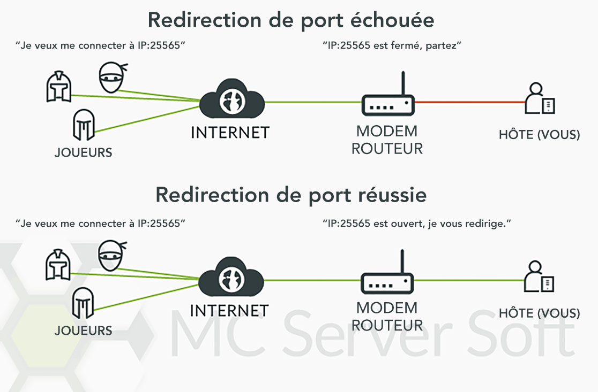
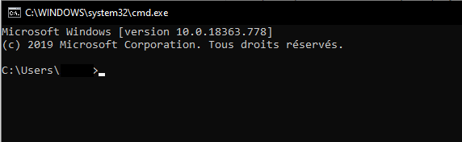
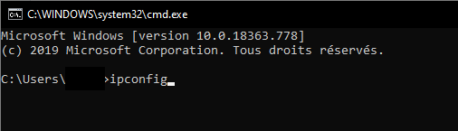
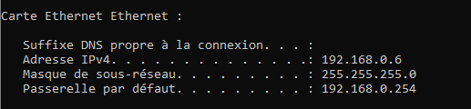
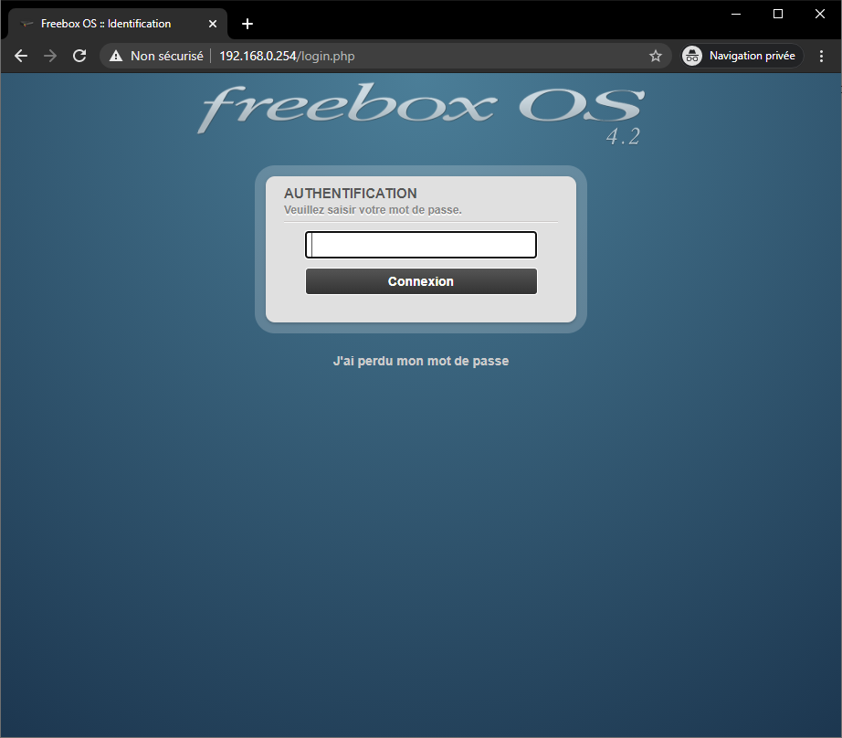

# La redirection de port

## Introduction

J'aurais pu écrire un tutoriel pour ouvrir un port de A à Z, mais à la fin vous auriez fait des choses sans même savoir à quoi elles correspondent. Résoudre les problèmes et maintenir votre réseau serait difficile et long. Dans ce guide, nous allons nous concentrer sur la redirection de port et la logique de base qui se cache derrière.

La redirection de port, ou ouverture de port, n'est vraiment pas si difficile qu'il n'y paraît. Le but d'une redirection de port est de rendre accessible un logiciel spécifique de votre ordinateur depuis Internet. Ce procédé est utilisé communément pour des serveurs de jeu, des échanges peer-to-peer ou des applications voix-ip par exemple.

Ce n'est pas quelque chose que vous allez mettre en place sur votre PC directement, mais sur l'interface web de votre routeur et/ou modem. Dans la plupart des cas (en France en tout cas), les modems contiennent aussi un routeur intégré, donc il n'y aura qu'un seul appareil à configurer.

Dans mon cas, j'ai désactivé la fonction routeur de mon modem et j'y ai relié un routeur externe plus puissant. Je devrais donc ouvrir un port sur les deux appareils (modem et routeur externe).

Comme vous pouvez le voir, ça peut devenir un peu déroutant si vous ne savez pas comment est organisé votre réseau.

## Plusieurs types d'équipements réseau

Dans un réseau, vous êtes susceptibles de trouver ces appareils :

Appareil | Description
--- | ---
Modem | Il est le plus souvent fourni par votre Fournisseur d'accès à Internet (FAI). En termes simples : il permet de recevoir et d'envoyer les données nécessaires pour votre connexion internet/téléphone/TV.
Routeur | Il permet de créer un réseau (filaire ou Wifi) entre les appareils de votre maison (ordinateurs, téléphones, imprimante...).
Box tout-en-un | C'est le type d'appareil le plus commun en France, elle combine un modem, un routeur et parfois un décodeur TV.
Switch |Ressemble à un routeur, mais fait moins. Il est un peu comme une multiprise réseau, *ex. 1 câble rentre, 3 câbles en sortent.*
Hub | Honnêtement, jetez ces trucs. Les hubs sont très vieux, ce sont les ancêtres des switch. Tout ce qu'ils font, c'est recevoir des données et les rediriger vers tous les autres appareils. Ils ajoutent de la latence et des interférences sur le réseau pour rien. C'était juste pour signaler qu'il serait temps de passer à un switch.

Regardez comment est organisé votre réseau, ce sera utile pour la suite.

## Créer la règle de redirection

Maintenant que vous avez une idée de ce que fait un routeur ou un modem, il est temps de vous connecter dessus pour le configurer.

Chaque fabricant possède sa propre interface, donc elles sont toutes différentes. Il serait impossible pour nous de faire un guide complet pour chaque modèle, mais nous avons fait un guide général qui devrait pouvoir aider.

### Étape 1 : assurez-vous d'avoir une box compatible

Pour pouvoir ouvrir un port, il faut impérativement avoir une connexion filaire (DSL ou fibre). Cela signifie que si vous avez une box 4G/cellulaire, il sera impossible de configurer une redirection.

Si vous avez bien une connexion filaire, il est très probable que votre box supporte les redirections, mais ceratins FAI peuvent bloquer cette option.

### Étape 2 : trouver l'ip de votre box (passerelle par défaut)

Ouvrez l'invité de commande. Pour cela, faites <kbd>touche Windows + R</kbd> puis écrivez `cmd` et appuyez sur <kbd>Entrée</kbd>. Ou vous pouvez rechercher `Invité de commandes` dans la liste de vos applications

Tapez `ipconfig` et appuyez sur <kbd>Entrée</kbd>.

Ceci est ce que j'obtiens, ce sera un peu différent pour vous mais le schéma général sera le même. Ce dont nous avons besoin est l'adresse IP de la ***Passerelle par défaut*** (ici 192.168.0.254).

### Étape 3 : accéder à l'interface de la box

Ouvrez un navigateur et entrez cette IP dans la barre d'adresse, vous arriverez sur l'interface web de votre routeur (dans l'exemple une Freebox).

À partir de maintenant, vous devrez connaître le mot de passe administrateur de votre box.
SI il n'a jamais changé, ça peut être le nom/suméro de série de votre box. Essayez les différents nombres écrits sur votre box, souvent à l'arrière.
Si aucun ne fonctionne, vous pouvez chercher en ligne le mot de passe usine de votre box.

### Étape 4 : mettre en place la redirection

Premièrement, allez voir sur [ce site](http://pixelboys.fr/regroupement-creer-une-redirection-de-port/), ils ont plusieurs tutoriels en détail pour les principaux FAI Français. Si votre box n'est pas dessus, vous pouvez suivres les étapes générales qui suivent :

- Activer le mode de configuration avancé si il existe

- Trouvez les réglages, et la section "réseau local"

- Trouvez la page "gestion des ports" ou "NAT/PAT"

- Créez une nouvelle règle de redirection

- entrez l'adresse ip locale de votre PC (Vous pouvez la trouver en reproduisant l'étape 2, mais en cherchant `Adresse IPv4`)

- choisissez le protocole TCP et reglez la valeur du port externe/public et local/privé sur 25565 (ou un autre port si vous avez modifié les paramètres de votre serveur)

- Appliquez tous les changements

Une fois que la redirection est configurée, vous pouvez vérifier qu'elle fonctionne. Pour cela, démarrez votre serveur Minecraft et allez sur [https://canyouseeme.org/](https://canyouseeme.org/). Entrez votre adresse ip public ainsi que le port du serveur et cliquez sur <kbd>check port</kbd>. Si la règle a été corrctement crée, le port devrait être marqué comme ouvert.

Vous pouvez maintenant partager votre ip publique à vos amis et leur demander de rejoindre votre serveur avec.

J'espère que ce guide aura été un minimum utile, bonne chance !
